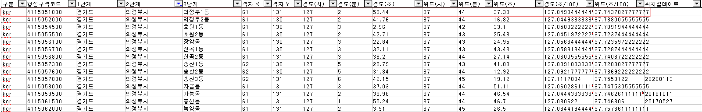

<h1><b>Bigs-Test</b></h1>

 

<h3>[개발 환경]</h3>
- <b>Framework</b>: &nbsp; SpringBoot 3.2.4 
- <b>Jdk</b>: &nbsp;&nbsp;&nbsp;&nbsp;&nbsp;&nbsp;&nbsp;&nbsp;&nbsp;&nbsp;&nbsp;&nbsp;&nbsp;&nbsp; Oracle OpenJDK 21.0.2 
- <b>DB</b>: &nbsp;&nbsp;&nbsp;&nbsp;&nbsp;&nbsp;&nbsp;&nbsp;&nbsp;&nbsp;&nbsp;&nbsp;&nbsp;&nbsp;&nbsp;&nbsp;Mysql, H2 
- <b>Tool</b>: &nbsp;&nbsp;&nbsp;&nbsp;&nbsp;&nbsp;&nbsp;&nbsp;&nbsp;&nbsp;&nbsp;&nbsp;&nbsp;&nbsp;Intellij

 

<h3>[모듈 구성]</h3>
- <b>api-externalApi</b>: &nbsp; 공공데이터 외부 API 
- <b>api-internalApi</b>: &nbsp;&nbsp; DB 조회 내부 API 
- <b>domain</b>: &nbsp;&nbsp;&nbsp;&nbsp;&nbsp;&nbsp;&nbsp;&nbsp;&nbsp;&nbsp;&nbsp;&nbsp;&nbsp;&nbsp; 레포지토리, 공통 파일, 도메인

 

<h3>[설명]</h3>
- 데이터베이스는 개인적으로 사용하는 우분투 기반 DB 서버로 연동했습니다. 
- "경기도 의정부시 문충로 74" 주소의 x,y 값은 현재 공공 API에서 제공하지 않아, "의정부시 의정부1동"의 x,y 값으로 임시 대체했습니다. 

 

<h3>[참고 사이트]</h3>
1. 코틀린 기본 문법 
   - https://cjw-awdsd.tistory.com/20
2. 코틀린 환경에서의 JPA 사용법 
   - https://ittrue.tistory.com/482
3. 멀티모듈 프로젝트 구성 
   - https://junuuu.tistory.com/627
   - https://cjw-awdsd.tistory.com/55
